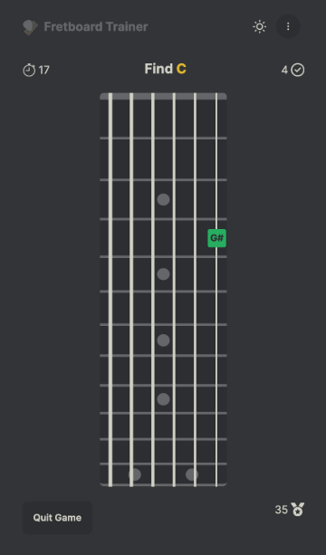
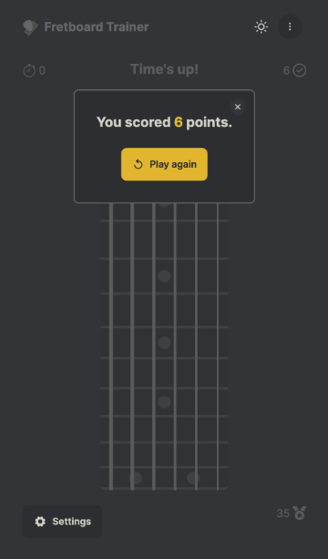
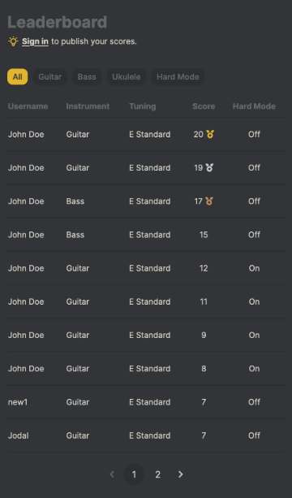

# Fretboard Trainer

Train your fretboard knowledge. Practice quickly locating notes on the fretboard.





## Live Demo

[fretboardtrainer.vercel.app](https://fretboardtrainer.vercel.app/)

## Description

Fretboard Trainer is a progressive web app built with Next.js 14, Typescript and Tailwind CSS.

On the homepage you can play a game where you are challenged to find notes on the fretboard one at a time. The goal for the player is to find as many notes as possible before the timer ends. Each successful attempt awards 1 point and there is no penalty for an unsuccessful attempt.

The player's score history is saved to their browser storage and is displayed in a History table below the game on the homepage. The player can also sign in using their Google account to save their score history to their account. Players who are signed in can also choose to publish their scores to the public leaderboard which is also displayed on the homepage.

The player can also select their preferred settings (whether signed in or not) to change the instrument, change the tuning, activate a hard mode, use a left-handed fretboard and more.

The design of the page is responsive with a vertical fretboard layout for smaller/portrait screens and a horizontal layout for larger/landscape screens.

## Features

- Plays the sound of the note that is selected.
- Choose an instrument (guitar, bass, ukulele).
- Select preferred tuning (standard, drop, open, etc).
- Multiple game modes; free-choice (regular) or string-specific (hard mode).
- Decide which strings to include in the game.
- Decide to include accidentals as sharps, flats, both or neither.
- Switch between right-handed or left-handed fretboard layout.
- Switch between light and dark colour schemes.
- Switch between horizontal or vertical fretboard layout.
- Keep track of previous scores without signing in (browser storage).
- Sign in to keep history of previous scores and track progress over time.
- Publish your score to the public leaderboard.
- Continue playing and recording scores while offline.

## Planned Updates

- Sign in using email and password.
- Support custom tunings.
- Support more instruments:
  - 7-string & 8-string Guitar
  - 5-string & 6-string Bass
  - Mandolin
  - Banjo
  - Lute
- Native Android app.

## Running the App Locally

### Prerequisites

You will need Node.js which can be downloaded [here](https://nodejs.org/).

### Installation

1. Download or clone this repository.

   ```sh
   git clone https://github.com/Jimfarrugia/fretboard-trainer.git
   ```

2. Navigate to the project's root folder and create a file called `.env.dev` with the following content:
   _(replace the values with your own)_

   ```
   GOOGLE_CLIENT_ID="<your-google-client-id>"
   GOOGLE_CLIENT_SECRET="<your-google-client-secret>"
   AUTH_SECRET="<your-auth-secret-string>"
   DATABASE_URL="<your-database-url>"
   ```

3. Navigate to the project's root folder and run the following command to install the required NPM packages.

   ```sh
   npm install
   ```

4. Start the development server by running the following command.

   ```sh
   npm run start
   ```

5. If it does not open automatically, open the application in your web browser at the following address:
   ```
   localhost:3000
   ```

### Contribution

Please feel free to submit issues and pull requests via Github if you'd like to contribute.

Any known bugs or publicly planned features can be found and can be found in the [issues page](https://github.com/Jimfarrugia/fretboard-trainer/issues) of this repository.
